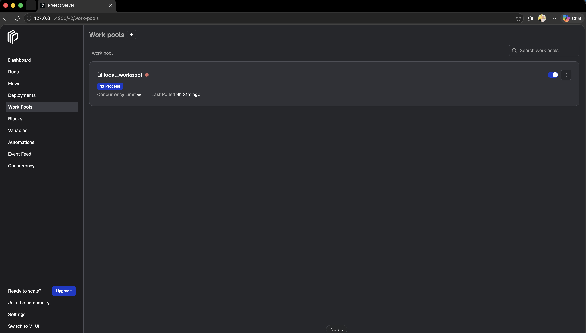
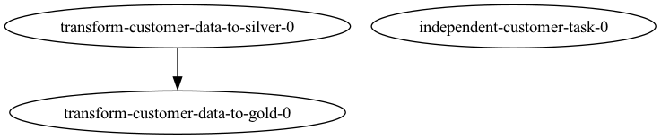
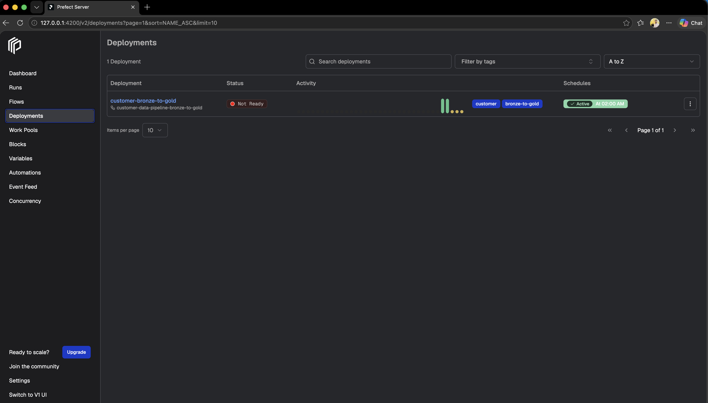

# Data Engineering End-to-End Transformation Framework

## Purpose

This repository is a reusable framework for building, testing, and orchestrating
batch data transformations with Apache Spark and Prefect.

It provides a consistent path for moving data through medallion-style layers:

```text
Source data -> Bronze -> Silver -> Gold -> Consumer
```

The framework separates responsibilities so transformation logic can be tested
locally, executed against an S3-compatible object store such as MinIO, and
orchestrated as a Prefect flow.

## Framework Responsibilities

| Area | Responsibility | Location |
| --- | --- | --- |
| Runtime configuration | Load environment variables and define project paths | `.env`, `common/spark.py` |
| Spark infrastructure | Create a Spark session configured for MinIO/S3A | `common/spark.py` |
| Shared transformations | Load, validate, deduplicate, aggregate, and write DataFrames | `common/utils.py` |
| Domain transformations | Apply customer-specific Bronze-to-Silver and Silver-to-Gold rules | `transformations/customer/` |
| Orchestration | Run transformations as retryable Prefect tasks and flows | `prefect/flows/` |
| Deployment | Define the Prefect deployment, schedule, and work pool | `prefect.yaml` |
| Verification | Test shared and domain transformation behavior | `tests/` |

## Architecture

```text
                           +----------------------+
                           |      Prefect Flow    |
                           | customer_data_pipeline |
                           +----------+-----------+
                                      |
                         +------------+------------+
                         |                         |
                         v                         v
                  Bronze -> Silver           Silver -> Gold
                  customer transform        customer transform
                         |                         |
                         +------------+------------+
                                      |
                                      v
                           +----------------------+
                           |    Spark + S3A       |
                           |       MinIO          |
                           +----------------------+
```

### Data layers

- **Bronze** contains source-aligned data with minimal transformation.
- **Silver** contains deduplicated, validated customer-order data.
- **Gold** contains business-ready, region-level aggregates prepared for downstream consumers.

The current customer pipeline uses these default locations:

```text
s3a://<MINIO_BUCKET>/bronze/input.csv
s3a://<MINIO_BUCKET>/silver/customer_orders
s3a://<MINIO_BUCKET>/gold/region_order_summary
```

Paths can be overridden through Prefect deployment parameters or direct
function arguments.

Silver and Gold are also registered as Spark SQL catalog tables
(`silver.customer_orders`, `gold.region_order_summary`) with per-column
`COMMENT`s, not just raw Parquet at the paths above — see
[Data Dictionary and Agentic AI Compatibility](#data-dictionary-and-agentic-ai-compatibility).

## Project Structure

```text
common/
  spark.py                         Spark session and environment configuration
  utils.py                         Shared DataFrame operations, catalog table registration, and
                                    data dictionary generation

transformations/
  customer/
    bronze_to_silver.py            Customer Bronze-to-Silver transformation
    silver_to_gold.py              Customer Silver-to-Gold transformation

prefect/
  compose.yml                      Local Prefect server and PostgreSQL services
  flows/customer_flow/
    customer_flow.py               Prefect tasks and customer pipeline flow
    render_customer_flow.py        Flow visualization helper

tests/
  conftest.py                      Shared Spark test fixture
  test_utils.py                    common/utils.py unit tests
  test_transformations/
    test_customer_flow.py          Bronze-to-Silver / Silver-to-Gold flow tests
  fixtures/                        CSV and Parquet test data

docs/
  data_dictionary.md                Human-readable, auto-generated data dictionary
  data_dictionary.json               Machine-readable manifest backing the Markdown doc

experiment.ipynb                   Interactive Spark exploration
prefect.yaml                       Prefect deployment configuration
pyproject.toml                     Python package metadata
requirements.txt                   Direct project dependencies
spark-warehouse/                   Local Spark warehouse for managed tables

.github/
  workflows/ci.yml                 GitHub Actions CI (installs deps, runs pytest)
```

## Configuration

Create a local `.env` file at the project root. Do not commit credentials.
Spark reads these settings when `build_spark_session()` is called:

```dotenv
MINIO_ACCESS_KEY=<access-key>
MINIO_SECRET_KEY=<secret-key>
MINIO_ENDPOINT=http://localhost:9000
MINIO_BUCKET=data-bucket
PREFECT_API_URL=http://127.0.0.1:4200/api
```

`MINIO_ENDPOINT` defaults to `http://localhost:9000` when omitted. The access
key and secret key are required for Spark transformations that use MinIO.
`PREFECT_API_URL` tells the Prefect CLI, flow, and worker which Prefect API to
use. For the local Docker Compose server, it should be
`http://127.0.0.1:4200/api`.

## Installation

Use a project virtual environment:

```bash
python3.12 -m venv .venv
source .venv/bin/activate
python -m pip install -r requirements.txt
```

The requirements file lists direct dependencies only. Packages required by
Prefect, PySpark, pytest, and testmon are installed automatically by pip.

## Running the Framework

### Run a transformation directly

```bash
source .venv/bin/activate
source .env
python transformations/customer/bronze_to_silver.py
python transformations/customer/silver_to_gold.py
```

Direct execution uses the default S3A paths. For reusable application code,
call `run_transformation_clean(input_path, output_path)` with explicit paths.

Each run also registers the target as a catalog table (`silver.customer_orders`
or `gold.region_order_summary`) and regenerates `docs/data_dictionary.md` /
`docs/data_dictionary.json`, so the schema docs never drift from what was
actually written. See
[Data Dictionary and Agentic AI Compatibility](#data-dictionary-and-agentic-ai-compatibility).


### Run the local Prefect services

```bash
docker compose -f prefect/compose.yml up -d
```

After the server is running, configure the client endpoint in the current
terminal before using Prefect commands:

```bash
export PREFECT_API_URL=http://127.0.0.1:4200/api
prefect config view
```
Also add `PREFECT_API_URL` to `.env` file.

Open seperate terminal and start a worker by creating and starting work pool:
NOTE: It will inherit all the dependencies of your local environment.

```bash
source .venv/bin/activate
source .env
prefect worker start --pool "local_workpool"
```
Keep this terminal running. The worker polls the work pool and executes flow
runs submitted by Prefect.



### Run the Prefect flow locally

```bash
source .venv/bin/activate
source .env
python prefect/flows/customer_flow/customer_flow.py
```

The flow runs the Bronze-to-Silver task first and then the Silver-to-Gold task.
Each task has retries configured for transient failures.

### Visualize the flow

`prefect/flows/customer_flow/render_customer_flow.py` renders the flow's task
graph without executing it, using Prefect's `flow.visualize()`:

```bash
source .venv/bin/activate
source .env
python prefect/flows/customer_flow/render_customer_flow.py
```

This requires Graphviz (`brew install graphviz` on macOS) plus the `graphviz`
Python package. It writes a PNG named after the flow, such as
`customer-data-pipeline-bronze-to-gold.png`, into the same directory as
`customer_flow.py`:



Nodes without an incoming arrow, like `independent-customer-task-0`, run in
parallel with the main Bronze-to-Silver-to-Gold chain.

### Build the deployment

The deployment in `prefect.yaml` is scheduled for 02:00 UTC and targets the
`local_workpool` work pool. Register it with the local Prefect server:


```bash
prefect deploy --all
```

This creates the `customer-bronze-to-gold` deployment and associates it with
the `local_workpool` process pool.




### Trigger a deployment manually

List deployments and trigger the customer deployment:

```bash
prefect deployment ls
prefect deployment run 'customer-data-pipeline-bronze-to-gold/customer-bronze-to-gold'
```

Monitor the run in the Prefect UI at `http://127.0.0.1:4200` or from the CLI:

```bash
prefect flow-run ls
```

### Stop the worker once you are done

You can stop the worker in terminal where you started it:

```bash
Ctrl + C
```

The PostgreSQL volume is preserved by default when the containers stop. This
keeps Prefect deployments and run history available when the server starts
again.

## Data Dictionary and Agentic AI Compatibility

Every Silver and Gold run does two things beyond writing Parquet:

1. **Registers a catalog table** via `build_create_table_sql` +
   `store_df_to_table` (`common/utils.py`), so the output is queryable as
   `silver.customer_orders` / `gold.customer_orders` with `DESCRIBE EXTENDED`
   and per-column `COMMENT`s, instead of only existing as an opaque Parquet
   path.
2. **Regenerates the data dictionary** via `build_data_dictionary_entry` +
   `write_data_dictionary`, which read that catalog metadata back out and merge
   it with curated metadata defined in each transformation module
   (`SILVER_COLUMN_CONFIG`/`GOLD_REGION_SUMMARY_COLUMN_CONFIG` and
   `SILVER_TABLE_METADATA`/`GOLD_REGION_SUMMARY_METADATA`):
   - **Grain** and **primary key** — what one row represents.
   - **Freshness** — the Prefect schedule that keeps the table current.
   - **Column-level description, unit, valid range/enum.**
   - **Caveats** — known gotchas (e.g. deduplication keeps only one row per
     `customer_id`, not one per order).

   The result is written to `docs/data_dictionary.json` (machine-readable,
   keyed by table name) and `docs/data_dictionary.md` (the same content
   rendered for humans). Because it's derived from `DESCRIBE EXTENDED` on
   every run, it can't silently drift from the real schema the way a
   hand-maintained doc can.

### Why this matters for agents/AI

An LLM agent (text-to-SQL, a RAG pipeline, or a tool-calling assistant) can't
safely use data it can only find as a raw file path with no semantics attached.
These changes give it what it needs to query and reason about the data
correctly instead of guessing:

- **Discoverability:** a stable catalog table name and schema an agent can
  look up (`DESCRIBE EXTENDED`, `information_schema`) instead of having to know
  an S3 path and infer the schema from Parquet.
- **Grounding:** `docs/data_dictionary.json` can be loaded directly into an
  agent's context or a retrieval index, giving it verified facts (grain,
  primary key, units, valid ranges) instead of letting it infer meaning from
  column names alone.
- **Guardrails against silent errors:** the caveats field surfaces exactly the
  kind of thing that causes an agent to produce a confidently wrong answer,
  such as this table having one row per customer rather than one row per
  order.
- **Trust/freshness signals:** the recorded update cadence lets an agent judge
  whether a table is current enough to answer a given question before relying
  on it.
- **No doc drift:** because the dictionary regenerates from the live schema on
  every run, an agent reading it is reading the same contract the data was
  actually written under.

## Testing Strategy

Run the complete suite:

```bash
source .venv/bin/activate
pytest
```

Run only tests affected by changed code with `pytest-testmon`:

```bash
pytest --testmon
```

The first testmon run builds its execution map. Later runs select tests based
on the code exercised by each test. A change to a shared utility can correctly
select several tests because those tests all depend on that utility.

For one exact test, use its node ID:

```bash
pytest tests/test_transformations/test_customer_flow.py::TestSilverToGoldFlow::test_silver_to_gold_region_totals
```

## Continuous Integration

GitHub Actions runs the test suite automatically via `.github/workflows/ci.yml`
on every push and pull request targeting `main`. The `test` job:

- Sets up Java 17 (Temurin), required by PySpark, and Python 3.11.
- Installs `requirements.txt` and the project itself (`pip install -e .`).
- Sets `SPARK_LOCAL_IP=127.0.0.1` so Spark's local-mode driver binds to
  loopback instead of trying to resolve the runner's network address.
- Runs `pytest`.

There is currently no CI deployment step. `prefect deploy --all` is run
manually from a machine that can reach the local Prefect server and worker,
since both currently run only on the developer's own machine (see
[Build the deployment](#build-the-deployment)).

Other useful commands:

```bash
pytest --collect-only -q           # list discovered tests
pytest -vv                         # show each test name and result
pytest tests/test_utils.py
pytest tests/test_transformations/test_customer_flow.py
```

## Adding a New Domain

1. Create a package under `transformations/<domain>/`.
2. Add one module per layer transition, such as `bronze_to_silver.py`.
3. Reuse `build_spark_session()` and shared functions from `common.utils`.
4. Keep input and output paths configurable through function arguments.
5. Add fixtures and focused tests under `tests/`.
6. Add Prefect tasks that call the domain transformation functions.
7. Add or update the deployment entrypoint and parameters in `prefect.yaml`.

Transformation modules should own domain rules. Generic DataFrame operations,
Spark configuration, and environment loading should remain in `common/`.

## Design Principles

- **Explicit boundaries:** shared infrastructure is separate from domain rules.
- **Configurable paths:** transformations accept paths instead of hardcoding
  execution-specific locations.
- **Repeatable execution:** transformations can run directly or through
  Prefect.
- **Testable behavior:** data quality rules are verified with local fixtures.
- **Safe configuration:** credentials stay in environment variables, not in
  source code or documentation.
- **Layered data:** each output layer has a clear contract and purpose.

## Troubleshooting

### Spark cannot connect to MinIO

Check that MinIO is running and that `.env` contains valid
`MINIO_ACCESS_KEY`, `MINIO_SECRET_KEY`, and `MINIO_ENDPOINT` values.

### A transformation cannot find a local fixture

Use a path relative to the project root or pass an absolute path. Local input
paths are validated before Spark reads them; remote `s3a://` paths are passed to
Spark for resolution.

### `pytest --testmon` selects more tests than expected

This is dependency-based selection. If several tests execute a changed shared
function, all of those tests may be selected. Use a test node ID for one exact
test, or run `pytest` when a complete suite is required.
